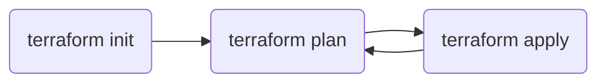

# CLI Basics

## Objective
Understand the basics of the terraform CLI and the different phases of the deployment pipeline.

## Overview

```mermaid
flowchart LR;
    A(terraform init)-->B(terraform plan);
    B-->C(terraform apply);
    C-->B
```
