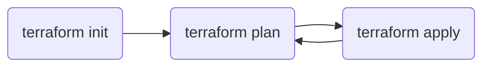

# CLI Basics

* TOC
{:toc}

## Objective

Understand the basics of the Terraform CLI and the different phases of the
deployment process.

## Overview

The Terraform CLI is a fully featured CLI for managing and deploying resources.
To get started all that is required it to write your HCL configuration,
initialize your project, plan the deployment, and apply it. There are many more
features but the majority of the time these 3 commands will be the most used.

The typical flow for development and deployment is:

### terraform init

The init command initializes the current directory for use with Terraform.
Several things happen when running the init command. The backend is set up if
required (backends are an advanced topic, for now we will be using local state).
Modules used within the project are copied locally. Finally, any plugins used
are retrieved and stored locally. This includes any providers used. This command
needs to be run anytime one of these 3 things changes. So if a backend
configuration is updated, modules are added, or new providers are used the
project needs to be re-initialized.

### terraform plan

The plan command can be used to see what changes are pending between the
configuration in the current project and the resources deployed. This command is
used constantly when working with Terraform to see the changes being made. The
plan command is informational only as it does not make any changes. It can be
used with the -out flag to write the changes to disk to be used with the apply
command.

### terraform apply

The apply command is used to deploy the current configuration. By default the
apply command will run a `terraform plan` before applying the changes. If a plan
plan output is passed to the apply then it will be used rather than creating a
plan.

## Review

In this section we reviewed the 3 most used commands in Terraform: init, plan
and apply. We understood their uses and where they fit in the development
lifecycle.

## Additional Reading

* [Command: init](https://developer.hashicorp.com/terraform/cli/commands/init)
* [Command: plan](https://developer.hashicorp.com/terraform/cli/commands/plan)
* [Command: apply](https://developer.hashicorp.com/terraform/cli/commands/apply)
